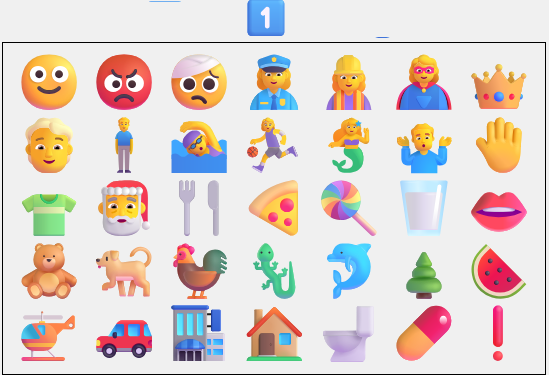
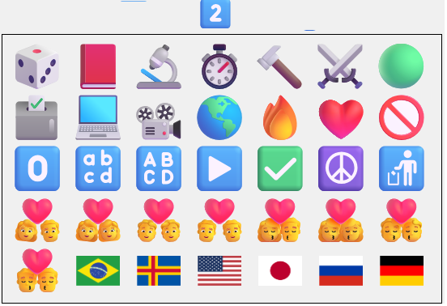
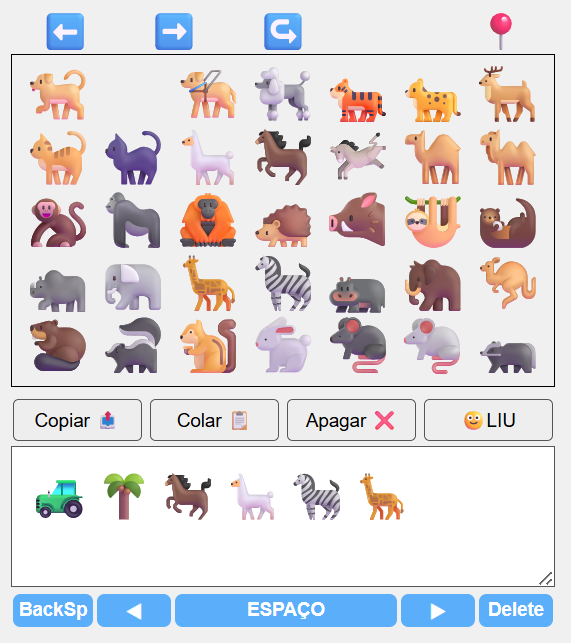
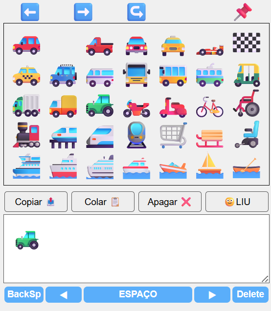

# EFU — Emoji Fácil Ulianov

**The fastest emoji keyboard in the world.**

EFU (Emoji Fácil Ulianov) is a new way to use emojis through a **two-step selection system**, allowing users to find any emoji quickly and intuitively.

---

## 🚀 The Problem

Modern emoji keyboards contain **1800+ emojis**, distributed across multiple categories.

Finding a specific emoji can take:
- Several seconds
- Or even minutes

This makes emojis powerful — but inefficient.

---

## 💡 The Solution — EFU

EFU introduces a **two-click system**:

1. Select a **base emoji (category)**
2. Select the **final emoji**

This reduces the search complexity dramatically.

---

## 🧠 How It Works

- 70 base emojis (categories)
- Each base opens a grid of ~34 related emojis
- Total coverage: **2300+ emojis**
- Access any emoji in **just 2 clicks**

---

## 🧩 Interface Overview

### 1️⃣ Category 1 — Human & Nature

---

### 2️⃣ Category 2 — Technology, Symbols & Flags

---

### 🐾 Final Screen Example — Animals

---

### 🌴 Final Screen Example — Plants

---

### 🚜 Final Screen Example — Vehicles

---

## ⚙️ Features

- 🔁 Two-level emoji navigation
- 📌 Pin final keyboard for fast repeated input
- ⬅➡ Navigation between emoji pages
- 🧠 Emoji memory (recent emojis)
- 🌍 Multi-language support
- 🎨 Skin tone selection
- 📏 Adjustable keyboard size
- 💾 Local storage (config + history)

---

## ✍️ LIU — Ulianov Intuitive Language

EFU is part of the **LIU (Linguagem Intuitiva Ulianov)** concept:

A pictographic language where:
- Emojis are used as words
- Text can be converted into emoji sequences

Button:
